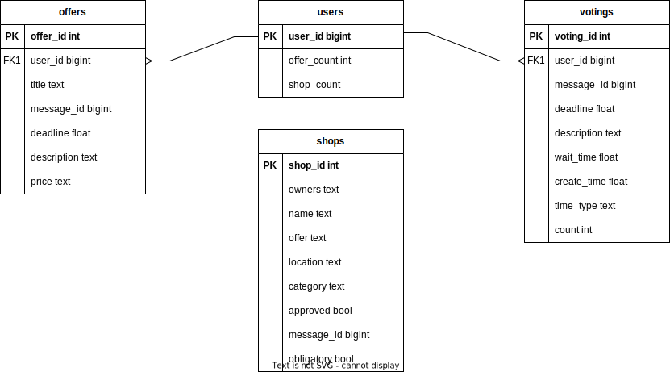

# Community Helper Bot
A Discord-Bot for a little minecraft project.

## Database
The bot uses a single [sqlite](https://www.sqlite.org/index.html) database, called "data.db". It's automatically created if it doesn't exist.
The following is the Entity-Relation-Diagram of the database:
